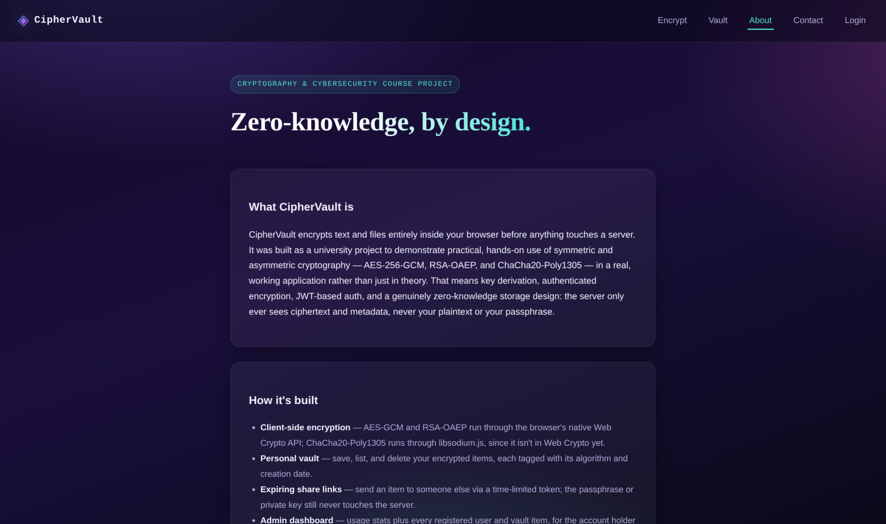
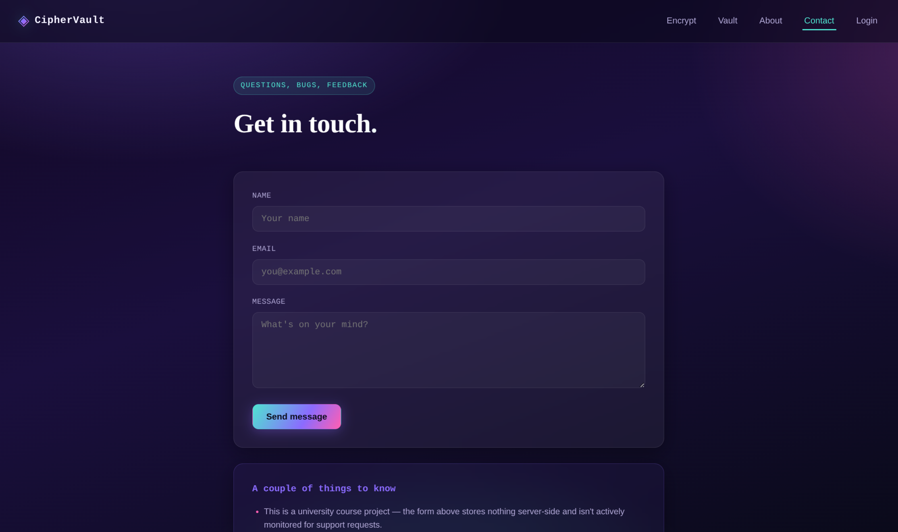

<div align="center">

# 🔐 CipherVault

**Encrypt and decrypt text and files entirely in your browser.**
AES-256-GCM · RSA-OAEP · ChaCha20-Poly1305 — with a personal key vault and expiring shareable links.

Built as a university project for **Cryptography & Cybersecurity**.

[](#-tech-stack)
[](#-tech-stack)
[](#-tech-stack)
[](#-license)

</div>

> **Plaintext and passphrases never leave the browser.** The server only ever stores ciphertext and metadata.

---

## 📑 Table of contents

- [About](#-about)
- [Demo](#️-demo)
- [Screenshots](#-screenshots)
- [Features](#-features)
- [Tech stack](#-tech-stack)
- [Project structure](#-project-structure)
- [Getting started](#-getting-started)
- [Database setup](#️-database-setup)
- [Team](#-team)
- [Accounts](#-accounts)
- [Deployment](#️-deployment)
- [Security notes](#-security-notes)
- [License](#-license)

---

## 📖 About

CipherVault lets you encrypt text and files right in your browser before anything touches a server, then optionally save the encrypted result to a personal vault or share it with someone else via a link that expires automatically.

It was built to demonstrate practical, hands-on use of symmetric and asymmetric cryptography (AES-256-GCM, RSA-OAEP, ChaCha20-Poly1305) in a real, working web application rather than just in theory — covering key derivation, authenticated encryption, JWT-based auth, and zero-knowledge storage design.

---

## 🖼️ Demo

**Try it live:** *[your Netlify URL here]*

Quick walkthrough of the app:

| Step | What happens |
|---|---|
| 1 · **Sign up** | Go to the Login page → "Sign up" tab → create an account with any email/password. |
| 2 · **Encrypt something** | On the home page, type text (or upload a file), pick an algorithm (AES-256-GCM / RSA-OAEP / ChaCha20-Poly1305), enter a passphrase, and hit **Encrypt**. |
| 3 · **Save to your vault** | Click **Save to Vault** to store the encrypted result under your account. |
| 4 · **View your vault** | Open the **Vault** tab to see all your saved items, each tagged with its algorithm and creation date. |
| 5 · **Share it** | Click **Share** on any vault item to generate a link that expires in 24 hours; anyone with the link and the correct passphrase (or private key, for RSA) can decrypt it — the server never sees either. |
| 6 · **Admin view** | Log in with the admin account to see a stats overview plus every registered user and vault item across the whole app. |

---

## 📷 Screenshots

### Home — Encrypt / Decrypt


### Login / Sign up


### About


### Contact


### Admin panel


---

## ✨ Features

- 🔒 **Client-side encryption** via the Web Crypto API (AES-GCM, RSA-OAEP) and libsodium.js (ChaCha20-Poly1305) — zero-knowledge by design
- 📝 **Text or file** encryption/decryption
- 🗄️ **Personal vault** — save encrypted items, list, and delete them
- 🔗 **Expiring share links** — send an encrypted item to someone else with a time-limited token
- 🛠️ **Admin dashboard** — manage all users and vault items, view usage stats
- 🔑 **JWT authentication** with bcrypt-hashed passwords

---

## 🧱 Tech stack

| Layer      | Tech |
|------------|------|
| Frontend   | HTML / CSS / vanilla JS, Web Crypto API, libsodium.js |
| Backend    | Python, Flask, flask-jwt-extended, flask-bcrypt |
| Database   | MongoDB (Atlas free tier) |
| Deployment | Frontend → Netlify · Backend → Render |

---

## 📁 Project structure

```
CipherVault/
├── backend/
│   ├── app.py                  # Flask app + all API routes
│   ├── requirements.txt
│   ├── models/                 # MongoDB document shape references
│   └── utils/
│       ├── crypto_helpers.py   # server-side AES-GCM / ChaCha20 helpers
│       └── auth_helpers.py     # admin-role JWT guard
├── frontend/
│   ├── index.html              # encrypt / decrypt UI
│   ├── login.html              # signup / login
│   ├── dashboard.html          # personal vault
│   ├── admin.html              # admin panel
│   ├── about.html              # about the project
│   ├── contact.html            # contact form
│   ├── share.html              # public page to open a shared link
│   ├── css/style.css
│   └── js/
│       ├── config.js           # ⚠ set your deployed API URL here
│       └── webcrypto.js / api.js / auth.js / dashboard.js / admin.js / share.js / contact.js
├── Screenshots_Websites/       # README screenshots
└── netlify.toml                # tells Netlify to publish frontend/
```

---

## 🚀 Getting started

### 1. Clone

```bash
git clone https://github.com/mahabubhasanmahin/CipherVault.git
cd CipherVault
```

### 2. Backend setup

```bash
cd backend
python -m venv venv
source venv/bin/activate        # Windows: venv\Scripts\activate
pip install -r requirements.txt
cp .env.example .env
```

Fill in `.env`:

```env
MONGO_URI=mongodb+srv://<user>:<password>@<cluster>.mongodb.net/ciphervault?retryWrites=true&w=majority
JWT_SECRET_KEY=<generate with: openssl rand -hex 32>
PORT=5000
ADMIN_EMAIL=admin@example.com
ADMIN_PASSWORD=<a strong password>
```

Run it:

```bash
python app.py    # http://localhost:5000
```

A free MongoDB Atlas (M0) cluster works fine — see [Database setup](#️-database-setup) below.

### 3. Frontend setup

```bash
cd frontend
python -m http.server 8080    # http://localhost:8080
```

Edit `frontend/js/config.js` to point at your backend once deployed:

```js
window.CIPHERVAULT_API_BASE = "https://your-backend.onrender.com/api";
```

---

## 🗄️ Database setup

1. Create a free cluster at [MongoDB Atlas](https://www.mongodb.com/cloud/atlas/register) (M0 tier, no card required).
2. **Database Access** → add a database user (username + password).
3. **Network Access** → allow `0.0.0.0/0` (required since Render/Railway use dynamic IPs).
4. **Database → Connect → Drivers → Python** → copy the connection string, append `/ciphervault` before the `?` as the database name.
5. Paste it into `MONGO_URI` in `.env`.

---

## 👥 Team

- Md Mahabub Hasan Mahin
- Md Majaharul Islam
- Walid Ahammed

---

## 👤 Accounts

- **Regular users:** sign up from the app's Login page — no pre-made accounts.
- **Admin:** auto-created on first backend startup from `ADMIN_EMAIL` / `ADMIN_PASSWORD` in `.env`. Logging in with that account redirects to `admin.html`, showing usage stats plus every user and vault item.

---

## ☁️ Deployment

**Backend → Render (free tier):**

1. New Web Service → root directory `backend`
2. Build: `pip install -r requirements.txt`
3. Start: `python app.py`
4. Add env vars: `MONGO_URI`, `JWT_SECRET_KEY`, `ADMIN_EMAIL`, `ADMIN_PASSWORD`

**Frontend → Netlify:**

1. `netlify.toml` at the repo root already sets the publish directory to `frontend/`
2. Update `frontend/js/config.js` with your live Render URL, then push

---

## 🔒 Security notes

- AES-GCM/ChaCha20 keys are derived from your passphrase via PBKDF2/Argon2 **in the browser** — the passphrase itself is never transmitted.
- RSA-OAEP generates a fresh key pair per operation; the private key is shown once and must be saved — there is no recovery mechanism.
- This is an academic project. For production use, add rate limiting, refresh tokens, HTTPS enforcement, and stronger private-key handling.

---

## 📄 License

Academic project — no license specified.

<div align="center">

Made with 🔐 by [Md Mahabub Hasan Mahin](https://github.com/mahabubhasanmahin), Md Majaharul Islam, and Walid Ahammed

</div>
